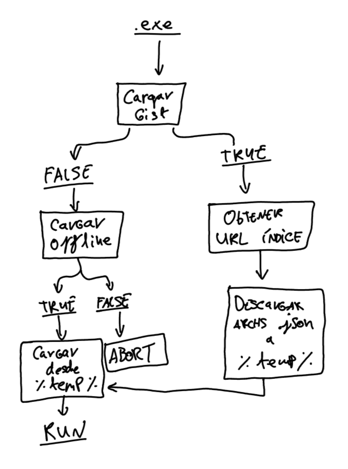
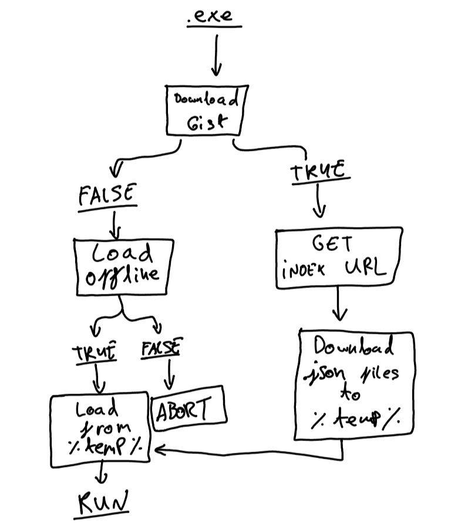

# Pygeist
Juego similar a QQSM con toques de Zeitgeist, pensado para practicar exámenes tipo test.  
No mantenido, ya no lo necesito para estudiar.  
Nombres, conceptos, y recursos sonoros empleados son pertenecientes a sus correspondientes dueños.  
https://github.com/kairotlei/Pygeist/blob/e67a41c102e855616cb5c712affda2aacfa8683e/SOURCE_1.2/py/uselesscoconut.py#L45-L64  

## ¡Funcionamiento para crear tu propio concurso!  
Comprueba y edita gitRoot en [SOURCE_1.2/py/uselesscoconut.py](SOURCE_1.2/py/uselesscoconut.py), y básate en este mismo proyecto.  

- - - 

Game similar to WWTBAM, with similarities to Zeitgeist, designed to practice multi-choice/1-correct answer exams.  
Not longer maintainted, I no longer need it for studying.  
Used names, concepts, and sound resources belong to their corresponding owners.  
https://github.com/kairotlei/Pygeist/blob/e67a41c102e855616cb5c712affda2aacfa8683e/SOURCE_1.2/py/uselesscoconut.py#L67-L86  

## Inner workings to create your own quiz!  
Check and edit gitRoot at [SOURCE_1.2/py/uselesscoconut.py](SOURCE_1.2/py/uselesscoconut.py), use this project as reference to make yours.  

